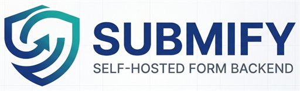

<div align="center">



# Submify

**Self-hosted Form Backend as a Service (FBaaS).**
One Docker stack, one API key, every form on every site you own.

[](LICENSE)
[](apps/api/go.mod)
[](apps/web/package.json)
[](docker-compose.yml)

[Quick start](#quick-start) · [Architecture](#architecture) · [API](#api-overview) · [S3 uploads](#external-s3-uploads-optional) · [Docs](docs/api.md)

</div>

---

Submify gives you a private Formspree/Form-to-email replacement you run yourself: a Go (Gin) API, a Next.js dashboard, PostgreSQL for storage, optional external S3-compatible storage for file uploads, and Nginx as a single entrypoint. Point any website's contact form at it, log in to read submissions, export to XLSX/PDF, and optionally get a Telegram ping when something new comes in.

**Repository:** [github.com/Raktim94/Submify](https://github.com/Raktim94/Submify)

## Why Submify

- **One API key, every site.** A single account `api_key` works across all your projects; no per-form setup dance.
- **You own the data.** Everything lives in your own PostgreSQL container — no third-party form service in the loop.
- **Bring your own storage.** AWS S3, Cloudflare R2, MinIO, Wasabi — anything S3-compatible works for file uploads.
- **One command to run.** A single Docker Compose stack behind Nginx; strong secrets are generated for you on first boot.

## What you get

- JSON form submission API — one primary `api_key` per account, plus optional per-project keys
- Admin dashboard with JWT (access + refresh token) login
- Projects CRUD, submission inbox, bulk delete
- Export submissions as **XLSX** or **PDF**
- Optional **Telegram** notification on new submission
- Optional **presigned PUT** uploads to any S3-compatible storage

Email notifications aren't built in — send mail from your own app after posting to Submify if you need that.

---

## Quick start

Requires [Docker Engine and the Compose v2 plugin](https://docs.docker.com/engine/install/).

```bash
curl -fsSL https://raw.githubusercontent.com/Raktim94/Submify/main/install.sh | bash
```

That single command clones the repo into `./Submify`, generates strong random secrets on first run, and brings up Postgres, the API, the dashboard, and Nginx with `docker compose up --build -d`. Re-run it any time to pull the latest version and redeploy.

Once the containers are up, open **http://localhost:2512** and create your first account at `/register`.

Prefer to see exactly what you're running first? Use the manual steps below instead.

### Manual install

```bash
git clone https://github.com/Raktim94/Submify.git
cd Submify
./scripts/compose-up.sh up --build -d
```

Windows (PowerShell):

```powershell
git clone https://github.com/Raktim94/Submify.git
cd Submify
.\scripts\Compose-Up.ps1 up --build -d
```

No `.env` is required to get started — `compose-up.sh` / `Compose-Up.ps1` auto-create **`.env.auto`** with strong random `POSTGRES_PASSWORD` and `JWT_SECRET` values on first run. Copy `.env.example` to `.env` only when you want to override defaults (custom CORS origins, port, cookie settings, etc.).

```bash
docker compose ps          # check container health
docker compose logs -f api # follow API logs
```

---

## Table of contents

1. [Architecture](#architecture)
2. [Requirements](#requirements)
3. [Quick start](#quick-start)
4. [URLs and ports](#urls-and-ports-browser-vs-containers)
5. [Configuration and environment variables](#configuration-and-environment-variables)
6. [First-time access](#first-time-access)
7. [Optional: Cloudflare Tunnel](#optional-cloudflare-tunnel)
8. [API overview](#api-overview)
9. [Connecting a client website (forms)](#connecting-a-client-website-forms)
10. [External S3 uploads (optional)](#external-s3-uploads-optional)
11. [Dashboard workflow](#dashboard-workflow)
12. [Limits and security defaults](#limits-and-security-defaults)
13. [Operations: logs, backup, updates](#operations-logs-backup-updates)
14. [Troubleshooting](#troubleshooting)
15. [License](#license)
16. [Developer & ownership](#developer--ownership)

---

## Architecture

```
                ┌────────────────────────┐
  Browser  ───▶ │   Nginx  :2512         │
  / clients     └────────────┬───────────┘
                              │
                ┌─────────────┴─────────────┐
                ▼                            ▼
     /api/* → Go API (Gin) :8080    /* → Next.js dashboard :3000
                │
                ▼
        PostgreSQL (single DB, JSONB-friendly)
                │
                ▼ (optional, per project)
     External S3-compatible storage (AWS S3 / R2 / MinIO / Wasabi)
```

- **Nginx** is the only published port (**2512**) and proxies `/api/*` to the Go API and everything else to the Next.js app.
- **PostgreSQL** stores all tenants in one database. Rows are scoped by `user_id` / `project_id`; the API never lists or mutates another user's data.
- **Object storage is optional and external** — connect any S3-compatible provider per project from the dashboard. No storage container ships with the stack.

The browser and external clients should use **one origin** for dashboard + API (e.g. `https://forms.example.com:2512/api/v1/...`), or configure **CORS** for separate sites — see [Connecting a client website](#connecting-a-client-website-forms).

---

## Requirements

- Linux, macOS, or Windows host with admin access (sudo-capable user on Linux)
- Docker Engine and Docker Compose v2 plugin
- Inbound TCP **2512** open on your host firewall / security group (or whatever port you front it with)
- TLS termination (reverse proxy or tunnel) for production

Default Compose uses **`./data/postgres`** next to the compose file, so the stack runs unmodified on Windows, macOS, Linux, and CasaOS-style installs.

### Before you install (host prep)

**Linux (recommended for servers):**

1. Install Docker Engine + Compose plugin (see the [official docs](https://docs.docker.com/engine/install/)).
2. Verify: `docker --version` and `docker compose version`.
3. Add your user to the `docker` group so you don't need `sudo` for every command: `sudo usermod -aG docker $USER`, then re-login.

**Windows / macOS:** install Docker Desktop, make sure it's running, then verify the same two commands above.

---

## URLs and ports (browser vs. containers)

Nginx is the only service that publishes a port in the default `docker-compose.yml`: **2512**, bound to `127.0.0.1` by default.

| What | URL |
|------|-----|
| Web dashboard | `http://<your-server-ip>:2512` (e.g. `http://localhost:2512`) |
| API | same host, under `/api/v1` |
| Health check | `http://<your-server-ip>:2512/api/v1/system/health` |

You don't open port 8080 on the host — that's only the API listening *inside* its container. Traffic flow: `Browser → :2512 (nginx) → /api/* → api:8080` and `→ /* → web:3000`.

Allow TCP **2512** from whatever networks should reach the UI/API (or 80/443 if you terminate TLS in front).

---

## Configuration and environment variables

No `.env` is required — defaults live in `docker-compose.yml`, and `./scripts/compose-up.sh` auto-generates strong secrets into `.env.auto` on first run. Copy `.env.example` to `.env` only to override values.

**API container** (see `apps/api/internal/config/config.go`):

| Variable | Default | Meaning |
|----------|---------|---------|
| `PORT` | `8080` | HTTP port inside the API container |
| `DATABASE_URL` | Compose default to `db` | PostgreSQL connection string |
| `JWT_SECRET` | random per-boot, or `.env`/`.env.auto` | JWT HMAC secret (≥32 characters; always override in production) |
| `ALLOWED_ORIGINS` | `http://localhost:2512,http://127.0.0.1:2512` | CORS allowlist (comma-separated) |
| `UPLOAD_MAX_SIZE_BYTES` | `26214400` (25 MiB) | Max upload size for presign |
| `UPLOAD_ALLOWED_MIME` | `image/png,image/jpeg,application/pdf,text/plain` | Allowed MIME types for presign |
| `PRESIGN_EXPIRY_MINUTES` | `10` | Presigned URL lifetime |
| `ACCESS_TOKEN_TTL_MINUTES` | `30` | Access token lifetime |
| `REFRESH_TOKEN_TTL_HOURS` | `24` | Refresh token lifetime |
| `POSTGRES_PASSWORD` | built-in default, or `.env`/`.env.auto` | DB password; must match `DATABASE_URL` |
| `TRUSTED_PROXIES` | private RFC1918 + loopback | CIDRs allowed to set `X-Forwarded-For` |
| `RATE_LIMIT_SENSITIVE_PUBLIC_RPM` | `25` | Login / setup / refresh / logout per IP |
| `RATE_LIMIT_SUBMIT_IP_RPM` | `90` | Public submit per client IP |
| `RATE_LIMIT_SUBMIT_KEY_RPM` | `180` | Public submit per API key |
| `RATE_LIMIT_AUTH_USER_RPM` | `600` | Authenticated API per user id |

**Web container:**

| Variable | Typical value | Meaning |
|----------|----------------|---------|
| `NEXT_PUBLIC_API_BASE` | `/api/v1` | Browser-side API prefix |
| `NODEDR_SUBMIT_PUBLIC_KEY` | empty or `pk_…` | Optional server-side key for the marketing contact-form proxy |
| `NODEDR_SUBMIT_SECRET_KEY` | empty or `sk_…` | Optional HMAC signing for that upstream request — never commit real values |

---

## First-time access

1. Open **`/register`** (or `POST /api/v1/auth/register`) and create your first account.
2. Log in at **`/login`**.
3. Open **Dashboard** — your **form API key** is shown there, with a **Default** inbox project created automatically.
4. Use that `api_key` on every website integration ([details below](#connecting-a-client-website-forms)). Add extra **Projects** only if you want separate ingest keys or organization.

JSON submissions work without any storage setup. Configure external S3 per project only when you need presigned file uploads.

---

## Optional: Cloudflare Tunnel

For servers behind CGNAT, or when you want Cloudflare in front:

```bash
export TUNNEL_TOKEN="your-token"
docker compose --profile tunnel up -d
```

The `cloudflared` service depends on Nginx — point your tunnel's DNS/config at this stack.

---

## API overview

Authoritative route list: `apps/api/internal/httpapi/server.go`. Full request/response contract: **[docs/api.md](docs/api.md)**.

| Area | Method | Path | Auth |
|------|--------|------|------|
| Bootstrap | GET | `/api/v1/system/bootstrap-status` | None |
| Health | GET | `/api/v1/system/health` | None |
| Auth | POST | `/api/v1/auth/register`, `/auth/login`, `/auth/refresh`, `/auth/logout` | None |
| Submit | POST | `/api/submit` | Header `x-api-key` |
| Projects | GET, POST | `/api/v1/projects` | Bearer |
| Project | PATCH | `/api/v1/projects/{id}` | Bearer |
| Submissions | GET | `/api/v1/projects/{id}/submissions` | Bearer |
| Bulk delete | DELETE | `/api/v1/projects/{id}/submissions/bulk` | Bearer |
| Presign | POST | `/api/v1/uploads/presign` | Bearer |
| Export | GET | `/api/v1/projects/{id}/export?format=xlsx|pdf` | Bearer |
| Security | PUT | `/api/v1/users/me/password` | Bearer |
| Security | POST | `/api/v1/users/me/api-key/rotate` | Bearer |
| Security | POST | `/api/v1/users/me/projects/rotate-keys` | Bearer |

---

## Connecting a client website (forms)

**1. Get your API key** — after login, open **Projects** and copy a project public key (`pk_live_...`). Use it as `x-api-key` when posting to `/api/submit`.

**2. CORS, if your form lives on another domain** — if your browser JS runs on `https://client.example.com` and calls Submify on `https://api.example.com`, set:

```bash
ALLOWED_ORIGINS=https://client.example.com
```

Comma-separate multiple origins; restart the API container after changing env.

**3. Recommended JSON body:**

```json
{
  "data": { "name": "Jane", "email": "jane@example.com", "message": "Hello" },
  "files": []
}
```

Flat objects (without `data` / `files`) are also accepted and stored as-is.

**4. `fetch` from the browser:**

```javascript
const API_KEY = "<your project public key>";
const SUBMIT_URL = "https://your-submify-host:2512/api/submit";

await fetch(SUBMIT_URL, {
  method: "POST",
  headers: { "Content-Type": "application/json", "x-api-key": API_KEY },
  body: JSON.stringify({
    data: { name: "Jane", email: "jane@example.com", message: "Hi" },
    files: []
  })
});
```

**5. Server-side proxy** — call Submify from your own backend with the same `POST /api/submit` contract so the key never reaches the browser.

> This repo's own Next.js dashboard (`apps/web`) ships an example of this pattern — a contact form posting through a Route Handler. See **`/docs/contact-proxy`** in the running app for the full guide, including a copy-paste prompt for AI coding assistants.

**Rate limits** are tiered so logged-in dashboard use isn't punished by anonymous caps:

- `GET /system/bootstrap-status` and `GET /system/health` — unlimited (use your own WAF/monitoring if needed)
- Login / refresh / logout / setup — per client IP, default **25/min**
- `POST /submit` — per IP and per API key, default **90/min** and **180/min**
- All Bearer-authenticated routes — per user id, default **600/min**

Nginx forwards `X-Forwarded-For`; the API trusts it only from `TRUSTED_PROXIES`. Tune the rate-limit env vars if legitimate traffic hits `429`.

---

## External S3 uploads (optional)

Form JSON always goes to PostgreSQL. File uploads are optional and use **any external S3-compatible provider** — nothing is bundled, so you bring your own bucket.

**1. Configure storage** — in **Settings** (account-level) or per-**Project**, set:

- `s3_endpoint` — provider API endpoint
- `s3_bucket` — your bucket name
- `s3_access_key` / `s3_secret_key` — provider-issued API credentials (not root/admin credentials)

Project-level credentials take priority; user-level (account) credentials are the fallback, for backward compatibility.

**2. Make sure the API container can reach the endpoint** — not just your browser:

| Provider | Typical endpoint |
|----------|-------------------|
| AWS S3 | `https://s3.<region>.amazonaws.com` |
| Cloudflare R2 | `https://<accountid>.r2.cloudflarestorage.com` |
| Self-hosted MinIO | `http://minio:9000` (Docker network) or a reachable host URL |

The access key needs `PutObject` (and related object) permissions on the target bucket; outbound network access from the `api` container to that endpoint must be allowed.

**3. Upload flow:**

```javascript
const presign = await fetch('/api/v1/uploads/presign', {
  method: 'POST',
  headers: { 'Content-Type': 'application/json', Authorization: `Bearer ${token}` },
  body: JSON.stringify({ project_id: projectId, filename: file.name, content_type: file.type, size: file.size })
}).then((r) => r.json());

await fetch(presign.upload_url, { method: 'PUT', headers: { 'Content-Type': file.type }, body: file });

await fetch('/api/submit', {
  method: 'POST',
  headers: { 'Content-Type': 'application/json', 'x-api-key': projectPublicKey },
  body: JSON.stringify({
    data: { name: 'Jane Doe', email: 'jane@example.com' },
    files: [{ object_key: presign.object_key, name: file.name, content_type: file.type }]
  })
});
```

1. Your app calls `POST /api/v1/uploads/presign` with `project_id`, `filename`, `content_type`, `size`.
2. Submify returns a short-lived `upload_url` and `object_key`.
3. The browser/client `PUT`s the file bytes directly to `upload_url` — this is the actual S3 upload.
4. Your app then sends the normal `POST /api/submit`, including `object_key` in `files`.
5. Submify stores that metadata alongside the submission.

**Common mistakes:** wrong endpoint URL for your region/account, credentials missing bucket permissions, bucket name typos, calling `/uploads/presign` without Bearer auth (or for a project you don't own), unsupported MIME types, files larger than `UPLOAD_MAX_SIZE_BYTES`, or putting secret keys in browser-exposed code instead of signing server-side.

---

## Dashboard workflow

1. Log in.
2. Copy your account form API key from the dashboard (one key, every site).
3. Point website forms at `POST /api/submit` with `x-api-key: <project_public_key>`.
4. Review submissions in the **Default** inbox (or additional projects for separation).
5. Export **XLSX** or **PDF**; use **bulk delete** to stay under the per-project cap.

---

## Limits and security defaults

| Item | Value |
|------|--------|
| Submissions per project | **5000** (then `429`) |
| Password hashing | Argon2id |
| Sessions | JWT access + refresh, Bearer auth for dashboard APIs |
| Rate limiting | Tiered (see [Rate limits](#connecting-a-client-website-forms)); authed users limited per account, not per shared IP |
| Tenant isolation | Project ownership checked on every authenticated, project-scoped route |

Use HTTPS in production. The account `api_key` is meant to be embedded in public sites (like a reCAPTCHA site key, not a secret). If it leaks, rotate it from **Settings** immediately — project-level keys can be rotated individually or all at once.

**Settings controls:** change login password, rotate account API key, rotate all project keys at once, update S3/storage credentials, save host bind/port preferences.

---

## Operations: logs, backup, updates

**Logs:** `docker compose logs -f [api|nginx|web|db]`

**Update (pull latest, rebuild, prune):**

```bash
cd Submify && git checkout -- scripts/prune-docker.sh && git pull && docker compose up --build -d && sh ./scripts/prune-docker.sh
```

If you installed with `./scripts/compose-up.sh`, substitute it for the bare `docker compose up --build -d` call so env files stay aligned. `git pull` updates code only — it never touches `./data/`, `.env`, or `.env.auto`.

**Backups:** `./data/postgres` is the only thing you need to back up; it lives next to `docker-compose.yml`, not inside the API image.

**Disk usage:** rebuilds accumulate image/build cache (not database growth). Run `sh ./scripts/prune-docker.sh` periodically — it never touches volumes or `./data/`.

---

## Troubleshooting

| Symptom | What to check |
|---------|----------------|
| API exits: `JWT_SECRET must be set…` | With `GIN_MODE=release`, the secret must be ≥32 characters. Set it in `.env`, or run via `./scripts/compose-up.sh` so `.env.auto` supplies one |
| Postgres auth errors after an upgrade | `POSTGRES_PASSWORD` no longer matches the existing `./data/postgres` cluster — restore the original password, or start from a fresh data dir if you accept losing the DB |
| `Permission denied` on `./scripts/prune-docker.sh` | Run `sh ./scripts/prune-docker.sh`, or `chmod +x scripts/prune-docker.sh` |
| `docker compose logs -f` looks "stuck" | `-f` follows the stream until Ctrl+C — that's expected, not frozen. Omit `-f` for a one-shot dump |
| `docker compose build` fails | Re-run with `--progress=plain` and read the error block. On a small VPS, try `--parallel 1` or add swap if the build OOMs |
| Nothing on port 2512 | Check firewall, `docker compose ps`, and Nginx logs |
| `401` on submit | `x-api-key` must match a valid account `api_key` or project `public_api_key` |
| `429` on submit | Per-project 5000 cap, or submit IP/key rate limits |
| CORS errors from the browser | `ALLOWED_ORIGINS` must include your site's exact origin (scheme + host + port) |
| Presign / upload fails | Confirm S3 credentials in Settings or Projects, that the API container can reach the endpoint, and that the file matches `UPLOAD_MAX_SIZE_BYTES` / `UPLOAD_ALLOWED_MIME` — see [common mistakes](#external-s3-uploads-optional) |

**Running tests:** `go test ./...` from `apps/api` covers password hashing, JWT, and related unit tests.

---

## License

Submify is licensed under the **Business Source License 1.1** — see [LICENSE](LICENSE). Free for individuals, students, and hobby projects; commercial use requires a license from the licensor. Third-party dependency licenses are listed in [THIRD_PARTY.md](THIRD_PARTY.md).

---

## Developer & ownership

Submify is built by **NODEDR INFOTECH PRIVATE LIMITED**.

- **Lead Developer & Founder:** Raktim Ranjit
- **Company:** NODEDR INFOTECH PRIVATE LIMITED
- **Website:** [www.nodedr.com](https://www.nodedr.com)

---

## Links

- Repository: [github.com/Raktim94/Submify](https://github.com/Raktim94/Submify)
- API reference: [docs/api.md](docs/api.md)
- Deployment guide: [docs/deployment.md](docs/deployment.md)
- Third-party licenses: [THIRD_PARTY.md](THIRD_PARTY.md)
